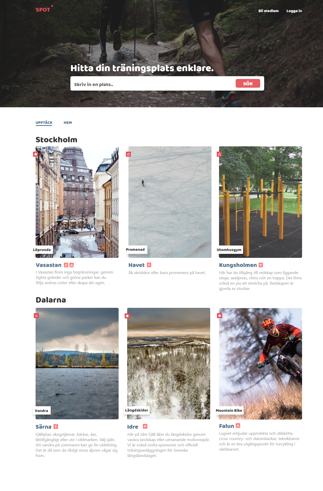

Case

## En nya plats att träna på

Iden till appen Spot uppkom i samband med en masterkurst på Karlstad universitet vari en uppgift bestod av att utforska och test ett nytt design koncept. Genom tre iterationer undersöker jag om de rekryterade testpersonerna upplever samma problem som jag gjorde. Nämligen att det är svårt och tidskrävande att i en ny stad eller land finna platser att träna på utomhus. Nedan följer en beskrivning av de tre designsprintar med tillhörande metoder för att generera krav.

  

Sprint 1

##Hur går användarna tillväga för att finna nya träningsplatser utomhus?

Det första steget i detta test var att testpersonerna fick visa testmoderatorn hur de idag gör när de söker efter platser att träna på. Vidare geonfördes en så kallad “walk through” i en hypotetisk app byggd ned Adobe Xd. Detta gjordes för att ge testpersonerna en mentalmodell av applikationen innan de trädde in i en fokusgrupp för att fritt diskutera ideer och förslag på tänkbara funktioner som skulle kunna ta plats i en framtida produkt.

###Metoder

- Observations test
- Exploratory test av en app
- Intervju av användare efter testet

- Focus grupp för att genera ideer

Sprint 2

##Är funktionaliteten av värde för användaren?

Det nästföljande användartest baserades på resultaten av det första testet vilket lade grunden till en ny prototyp utvecklades i Adobe Xd. Gränssnittet baserades på de förslag och ideer som har allra största chans att nå en slutgiltig produkt från föregående test. Ett användartest genomfördes på denna prototyp där syftet var att undersöka hur väl användargränssnittet hjälper användarna att utföra vanliga rutinuppgifter, som till exempel att kunna navigera till en plats att motionera på.

###Metoder

- Prototyp i Adobe XD
- Användartest
- Intervju av användare efter testet

  

Sprint 3

##Vilken information vill användaren egentligen se på en motionsplats?

Detta sista användartestet i denna serie av tester har till syftet att undersöka vilken information användarna helst vill ha presenterad på en specifik motionsplats. Liksom i första användartestet planterades en mental modell hos testdeltagarna genom att en “walk through” genomfördes av ett tänkbart scenario som tar testpersonen till en motionsplats i appen.

###Metoder

- Prototyp i Adobe XD
- Användartest - Prioriteringar av information som visas i appen

- Intervju av användare efter testet

Lösningen

##Spot - en plats att träna på.

Dessa tre sprintar resulterade visade

Den första sprinten visade genom ett explaratory test att användarna inte har någon specifik tjänst de vänder sig till när de ska söka efter nya platser att träna på. Vilket lade grunden för nästkommande sprintar vilka utforskade grundläggande funktionalitet (sprint 2) och vilken specifik information som användaren vill se på en specifik motinosplats (sprint 3). Nedan är en mockup på hur denna tjänst skulle se ut baserad på föregående sprintar.

